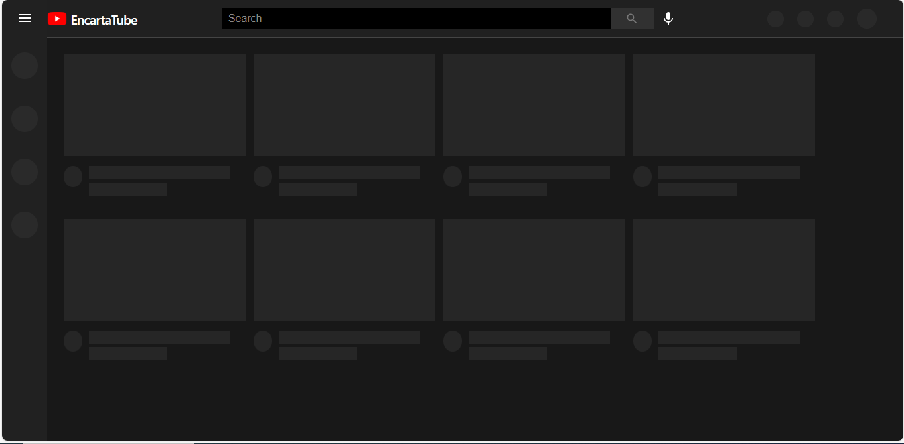

<a name="readme-top"></a>

<div align="center">

 <!-- LOGO -->

  
  <br/>

<!-- MAIN HEADING -->

  <h3><b>Loading Screens</b></h3>

</div>

<!-- TABLE OF CONTENTS -->
# 📗 Table of Contents

- [📖 About the Project](#about-project)
  - [🛠 Built With](#built-with)
    - [Tech Stack](#tech-stack)
    - [Key Features](#key-features)
- [🚀 Live Demo](#live-demo)
- [💻 Getting Started](#getting-started)
  - [Setup](#setup)
  - [Prerequisites](#prerequisites)
  - [Install](#install)
  - [Usage](#usage)
  - [Run tests](#run-tests)
  - [Deployment](#deployment)
- [👥 Authors](#authors)
- [🔭 Future Features](#future-features)
- [🤝 Contributing](#contributing)
- [⭐️ Show your support](#support)
- [🙏 Acknowledgements](#acknowledgements)
- [❓ FAQ (OPTIONAL)](#faq)
- [📝 License](#license)

<!-- INTRO -->
# 📖 Loading Screens<a name="about-project"></a>

> Loading Screens is a react YouTube clone app that shows the use of three loading screen effects; using thumbnail skeletons, circular loading progress or a custom loading effect.

> To use the 3 loading screens, open `client/src/components/feed/Feed.jsx` and change `type` to either feed, circle or custom in `<Skeleton type='feed' />`.

## 🛠 Built With <a name="built-with"></a>
1. React
2. CSS 3
3. Materials UI
4. Express JS
5. Axios

### Tech Stack <a name="tech-stack"></a>

<details>
  <summary>Client</summary>
  <ul>
    <li><a href="https://reactjs.org/">React</a></li>
    <li><a href="https://css3.com/">CSS 3</a></li>
    <li><a href="https://mui.com/">Materials UI</a></li>
    <li><a href="https://expressjs.com/">Express JS</a></li>
    <li><a href="https://axios-http.com/">Axios</a></li>
  </ul>
</details>

<!-- Features -->

### Key Features <a name="key-features"></a>

> - Thumbnail Loading Screen
> - Circular Progress Loading Screen
> - Custom Loading Screen

<p align="right">(<a href="#readme-top">back to top</a>)</p>

<!-- LIVE DEMO -->

LIVE DEMO

> Live demo coming soon...

<p align="right">(<a href="#readme-top">back to top</a>)</p>

<!-- GETTING STARTED -->

## 💻 Getting Started <a name="getting-started"></a>

> To get a local copy of the project, use this link:
> 
```sh
cd loading-screens
https://github.com/anyars-encarta/loading-screens.git
```

<!-- SETUP -->
### Setup

To setup this project, run this command:

```sh
cd api
npm start
```

```sh
cd client
npm start
```
### Prerequisites

1. A Browser (Preferably Google Chrome)
2. A Code Editor
3. Internet Connection
4. Git

<!-- INSTALL -->
### Install

Install this project with Iroko.

### Usage

To run the project, execute the following command:

```sh
cd api
npm start
```

```sh
cd client
npm start
```
### Run tests
To test the project, execute the following command:
```sh
npm run test
```
### Deployment

You can deploy this project using:
> 1. Netlify
> 2. Vercel
> 3. Render
> 4. Any Hosting site

<p align="right">(<a href="#readme-top">back to top</a>)</p>

<!-- AUTHORS -->
## 👥 Authors <a name="authors"></a>

👤 **Anyars Yussif**

- GitHub: [@anyars-encarta](https://github.com/anyars-encarta)
- Twitter: [@anyarsencarta](https://twitter.com/anyarsencarta)
- LinkedIn: [LinkedIn](https://www.linkedin.com/in/anyars-yussif/)


<p align="right">(<a href="#readme-top">back to top</a>)</p>

## 🔭 Future Features <a name="future-features"></a>

- [ ] **Add Interactivity to Top Menu Items**
- [ ] **Add Interactivity to Side Menu Items**
- [ ] **Add Video Playlists**

<p align="right">(<a href="#readme-top">back to top</a>)</p>

<!-- CONTRIBUTION -->
## 🤝 Contributing <a name="contributing"></a>

Contributions, issues, and feature requests are welcome!

<p align="right">(<a href="#readme-top">back to top</a>)</p>

<!--SUPPORT -->

## ⭐️ Show your support <a name="support"></a>

> If you like this project, please give it some starts ⭐️⭐️⭐️⭐️⭐️

<p align="right">(<a href="#readme-top">back to top</a>)</p>

<!-- ACKNOWLEDGEMENTS -->
## 🙏 Acknowledgments <a name="acknowledgements"></a>

> Special credit to [Safak](https://github.com/safak) and [microverseinc](https://github.com/microverseinc) for the linters conguration and materials.

<p align="right">(<a href="#readme-top">back to top</a>)</p>

<!-- FAQS -->
## ❓ FAQ (OPTIONAL) <a name="faq"></a>

- **How were the React and Linters utilised?**

  - The React and Linters were utilised with the help of resources provided by [@microverseinc](https://github.com/microverseinc).

- **What new features should be expected in the next release of the project?**

  - I am currently working on adding interactivity to the menu items as well as video playlists.

<p align="right">(<a href="#readme-top">back to top</a>)</p>

<!-- LICENSE -->

## 📝 License <a name="license"></a>

This project is [MIT](./LICENSE) licensed.

<p align="right">(<a href="#readme-top">back to top</a>)</p>
